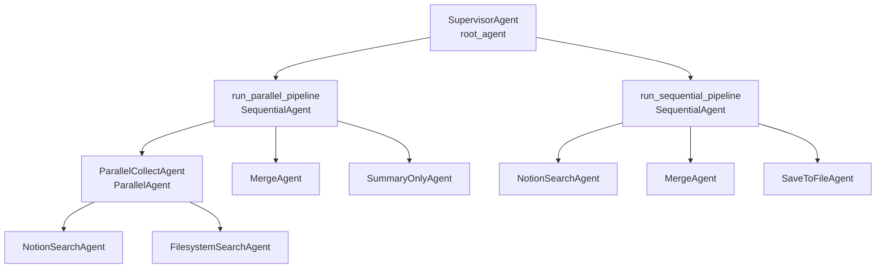

# ADK Notion MCP CLI

Google ADK로 만든 CLI 챗봇입니다.

- `filesystem MCP`
- `Notion MCP (Streamable HTTP + OAuth)`
- `PostgreSQL session`

## 실행

루트 `.env`는 .env_sample 참고하세요


Notion OAuth 로그인:

```bash
python3 main.py login-notion
```

채팅 실행:

```bash
python3 main.py
```

예시 질문
  - 노션에 강화학습 세미나 페이지 내용 요약해서 로컬로 저장해줘
  - 노션에서 강화학습 세미나 관련 내용 찾아서 요약해줘
  - 노션 내용과 로컬 파일을 같이 비교해서 통합 정리해줘
  - 노션 강화학습 내용 정리해서 markdown 파일로 저장해줘

## 에이전트 구조

```text
root_agent = SupervisorAgent
|
+-- run_parallel_pipeline (SequentialAgent)
|   |
|   +-- ParallelCollectAgent (ParallelAgent)
|   |   |
|   |   +-- NotionSearchAgent
|   |   +-- FilesystemSearchAgent
|   |
|   +-- MergeAgent
|   +-- SummaryOnlyAgent
|
+-- run_sequential_pipeline (SequentialAgent)
    |
    +-- NotionSearchAgent
    +-- MergeAgent
    +-- SaveToFileAgent
```


라우팅 기준:

- `run_parallel_pipeline`: Notion과 로컬 파일을 함께 조사, 비교, 통합할 때
- `run_sequential_pipeline`: Notion 내용을 읽어 정리한 뒤 markdown 파일로 저장할 때


## 주요 파일

- [main.py](/home/pachu/works/adk-project-mcp/main.py): CLI 진입점
- [agent.py](/home/pachu/works/adk-project-mcp/agent.py): `root_agent` export용 얇은 진입점
- [app/agent/root.py](/home/pachu/works/adk-project-mcp/app/agent/root.py): `SupervisorAgent`, `root_agent`
- [app/agent/workflows.py](/home/pachu/works/adk-project-mcp/app/agent/workflows.py): parallel/sequential workflow 정의
- [app/agent/sub_agents.py](/home/pachu/works/adk-project-mcp/app/agent/sub_agents.py): NotionSearch, FilesystemSearch, Merge, SaveToFile, Summary agent 생성
- [app/mcp/toolsets.py](/home/pachu/works/adk-project-mcp/app/mcp/toolsets.py): filesystem MCP, Notion MCP toolset 정의
- [app/prompt/instructions.py](/home/pachu/works/adk-project-mcp/app/prompt/instructions.py): 각 agent instruction 모음
- [app/tool/callbacks.py](/home/pachu/works/adk-project-mcp/app/tool/callbacks.py): tool callback 설정
- [app/services/chat_cli.py](/home/pachu/works/adk-project-mcp/app/services/chat_cli.py): 대화 루프와 event 로그 출력
- [app/services/notion_oauth.py](/home/pachu/works/adk-project-mcp/app/services/notion_oauth.py): OAuth 로그인과 토큰 refresh
- [app/config/settings.py](/home/pachu/works/adk-project-mcp/app/config/settings.py): 환경 변수 로딩
- [app/config/mcp_servers.example.json](/home/pachu/works/adk-project-mcp/app/config/mcp_servers.example.json): Notion MCP 설정 예시
